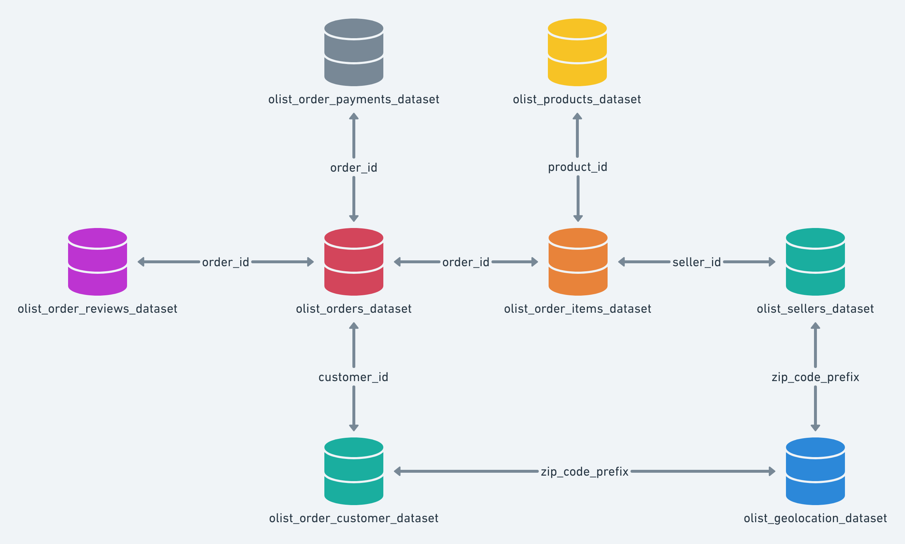

# Data Visualization and Analytics Interview at Hiflylabs

## Understanding the Dataset
### Context
FIXME
### Data Schema
The data is divided in multiple datasets for better understanding and organization. Please refer to the following data schema when working with it:
<picture>

</picture>

## Tasks

### Task 1 - Data Modeling & Visualization
Using the above mentioned semantic model diagram assamble the following data model in **Power BI**.

FIXME

> [!TIP]
> Multiple areas can be explored in the data model. Some examples are:
> - Sales
> - Orders
> - Sellers
> - Logistics
> - Customers
> - Web Analytics
> **Explore at least 3 areas in detail!**

Build 1-1 report for the following audiences:
- C-Suite
- Line Managers 

### Task 2 - Insight Generation
What are the 3 most important insights 